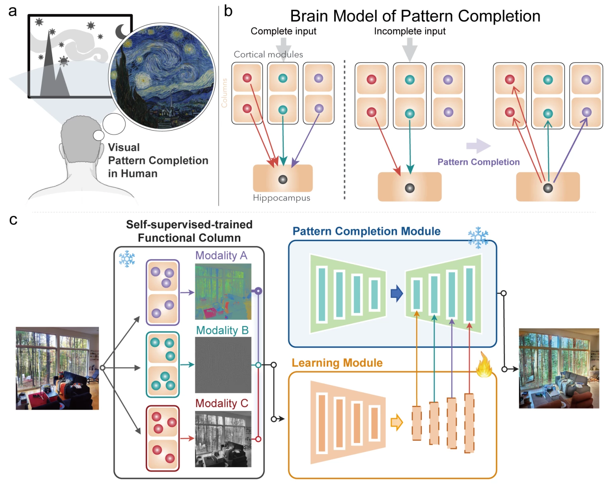
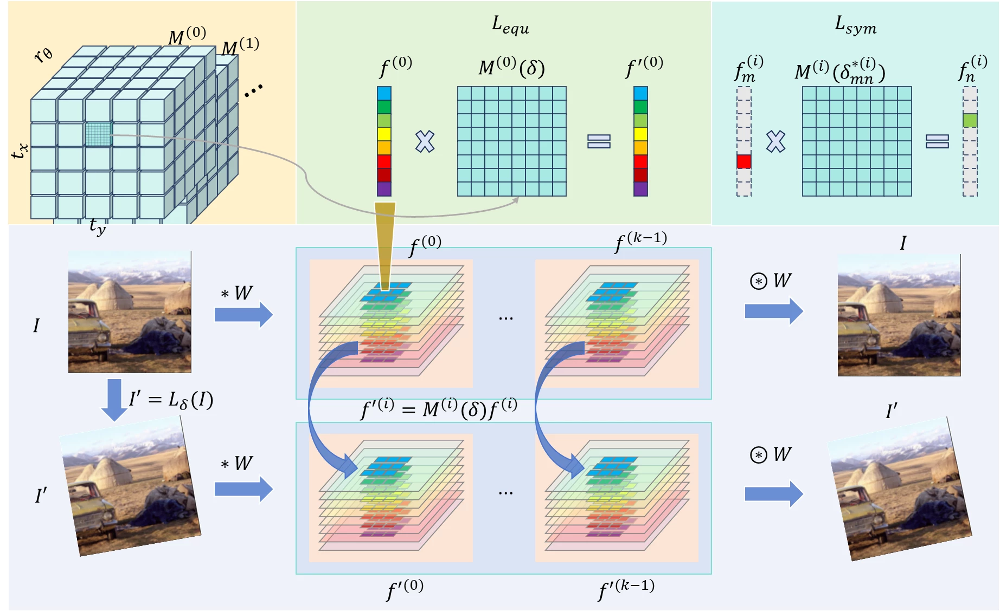
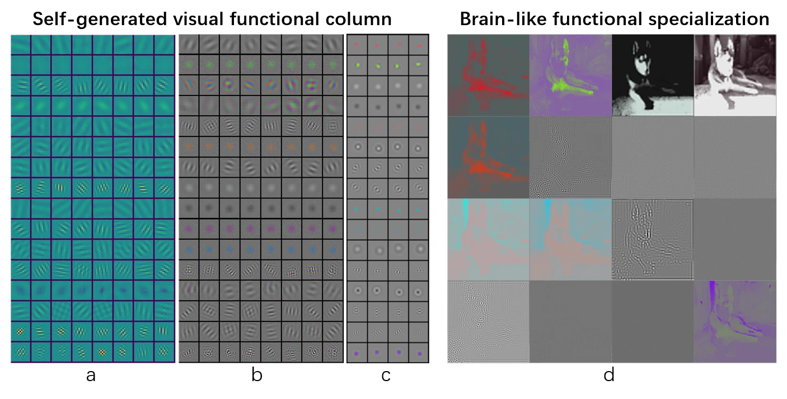
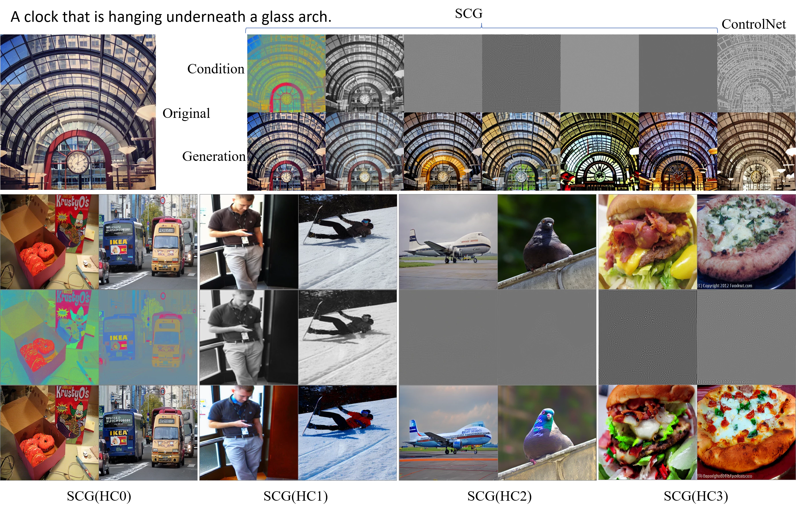
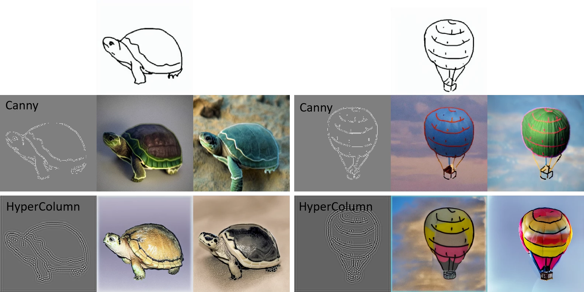
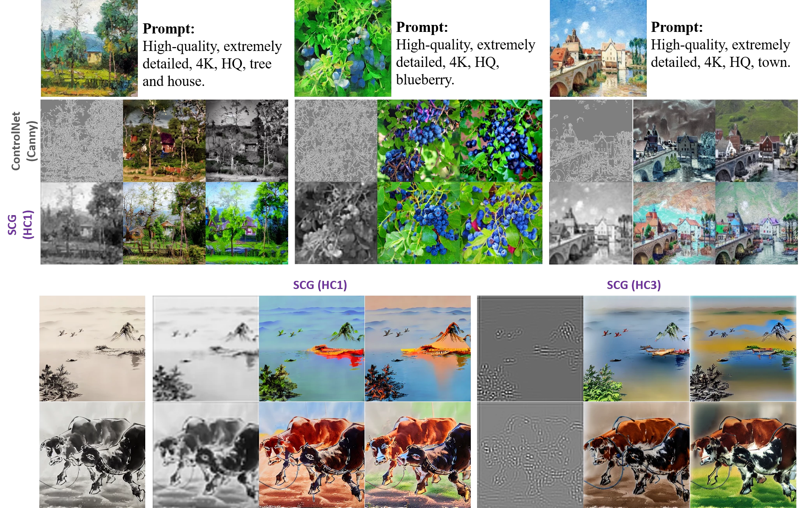
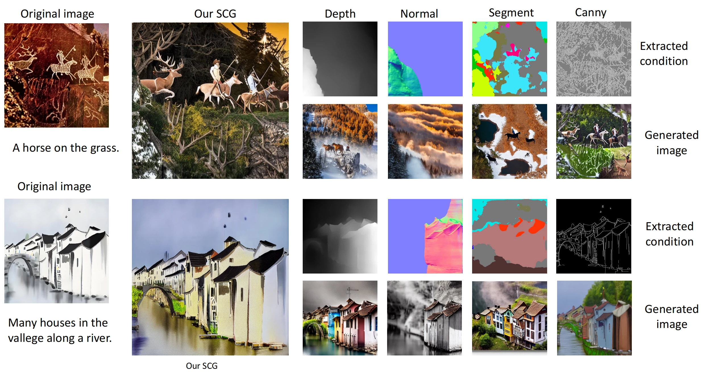
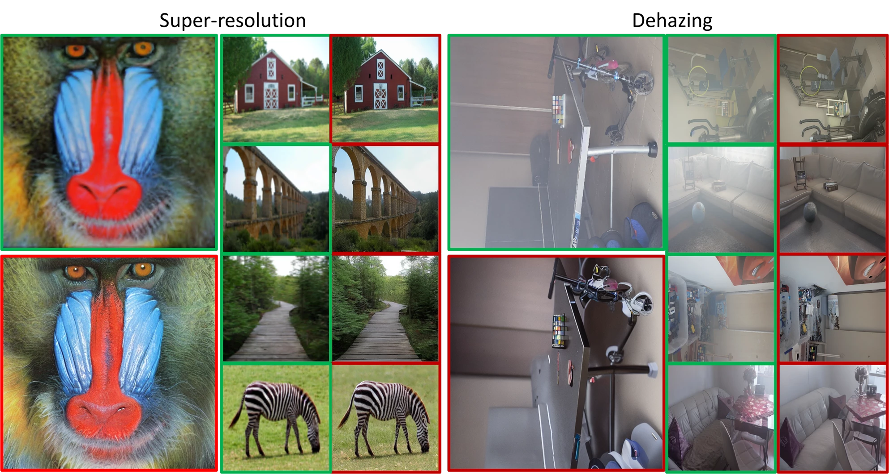
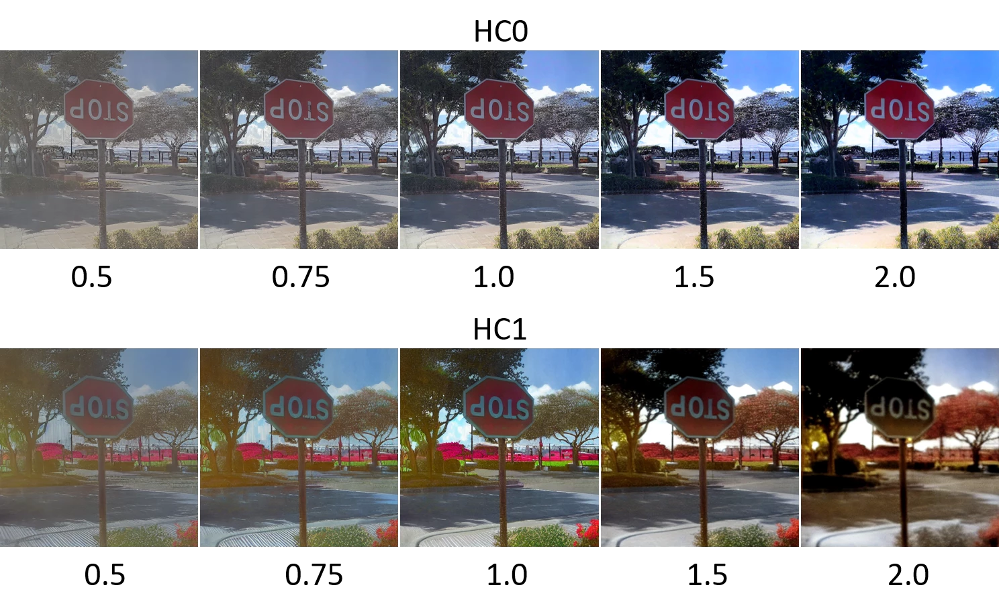
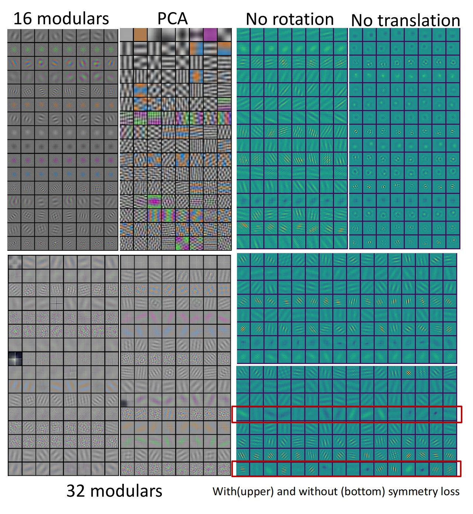

# Learning from Visual Pattern Completion 🤔

> Inspired by the cortical modularization and hippocampal pattern completion, we propose a self-supervised controllable generation (**SCG**) framework to achieve pattern completion and generate images.

[](https://github.com/BAAI-Brain-Inspired-Group/OPEN-Vis-ControlSD/)
[](https://gitee.com/chenzq/control-net-main)
[](./LICENSE)

**Learning from Pattern Completion: Self-supervised Controllable Generation (NeurIPS 2024) [[Arxiv]](https://arxiv.org/abs/2409.18694) [[OpenReview]](https://openreview.net/forum?id=83pV20DD2s&referrer=%5BAuthor%20Console%5D(%2Fgroup%3Fid%3DNeurIPS.cc%2F2024%2FConference%2FAuthors%23your-submissions))**

[Zhiqiang Chen*](https://github.com/dongrisuihan), [Guofan Fan*](https://github.com/Asterisci), [Jinying Gao*](https://github.com/JY-Gao), [Lei Ma](https://nbic.pku.edu.cn/rcdw/kyry/02c5f5ce8e254b1e82a48bebd0a24c33.htm), [Bo Lei](https://github.com/Bolei-engram), [Tiejun Huang](https://idm.pku.edu.cn/tjhuang), [Shan Yu](https://people.ucas.ac.cn/~yushan?language=en)



## 📰 News

- 🍾 Sep, 2024: [**SCG**](https://github.com/BAAI-Brain-Inspired-Group/OPEN-Vis-ControlSD/) is accepted by NeurIPS 2024, congratulations! We will release offical version as soon, please check in homepage.
- 🎉 Apr, 2024: For those interested, we update a [pre-release code](https://gitee.com/chenzq/control-net-main) in Gitee.

## 📄 Motivation

Our original motivation is to propose and validate a novel self-supervised pipeline to achieve broad generalizations.

This framework comprises two components: a modular autoencoder and a conditional generator. Given the extensive research on conditional generation, we leverage the existing, mature ControlNet for this aspect. Our core contribution lies in designing a modular autoencoder based on proposed equivariance constraint, successfully enabling the network to spontaneously develop relatively independent and highly complementary modular features. These features are crucial for subsequent conditional generation.

## 🛠️ Installation

Cause our work is based on ControlNet, please refer to [ControlNet Docs](https://github.com/lllyasviel/ControlNet?tab=readme-ov-file#production-ready-pretrained-models) to install environment.


## 🚀 Quickstart

```python
python tutorial_train.py
```

## 🔧 Setting

You can modify model and dataset in `tutorial_train.py`:
```python
modelarch_path = './models/cldm_v15.yaml'
resume_path = './image_log/checkpoint_deconv_down2_3/last.ckpt'
logger_path = 'shuimo_deconv2_3_test'
dataset_name = 'MyDatasetShuimo'
```

To select different hypercolumn, refer to `./models/cldm_v15.yaml`:
```yaml
hyperconfig:
  target: cldm.cldm.HyperColumnLGN
  params: 
    hypercond: [0]
    size: 512
```

During inferance phrase, we use a single A100 GPU and it requires about 11G RAM to run it per image.

## 📲 Modular Autoencoder



We propose a equivariance constraint for our modular autoencoder. The equivariance loss Lequ is the core of the equivariant constraint, primarily serving to increase independence between modules and correlation (or symmetry) within modules. The symmetry loss Lsym further enhances the correlation (or symmetry) of features within modules and suppresses the emergence of multiple unrelated features within the same module. The learned feature is visualized in the following:



## 🎯 Results

**We compress the raw image to enhance web experience. For raw images and more results, please refer to our paper.**

The models are trained on only COCO dataset and test on multiple tasks.

### 🐻 Conditional generation on COCO



The first line are the origin image and the prompt. The second line are conditions of multiple hypercolumn and canny. The last line are the generated images

### 🐻‍❄️ 0-shot generation

- 🐻‍❄️Scribble


- 🐨 Oil painting and Chinese washing and ink painting


- 🐼 Ancient graffiti


### 🐨 Comparison with ControlNet



### 🐼 More tasks under 0-shot generalization abilities



### 🦥 Manipulation



## 🦚 Ablation study



## 🦁 Discussion

We propose SCG and experimentally demonstrate that it can spontaneously emerge (or 0-shot generalize) various abilities, including super-resolution, dehazing, saturation and contrast manipulation, as well as conditional generation based on diverse styles such as oil paintings, ink paintings, ancient graffiti, sketches, and LineArt. Furthermore, SCG possesses two significant potentials: (1) Leveraging its self-supervision, SCG can further scale up its data and models to benefit from the scaling law, enhancing its basic capabilities; (2) Subsequently, SCG can be fine-tuned for specific tasks, leading to improved performance on particular tasks. These potentials suggest that SCG has the potential to become a foundation model for controllable generation. This framework comprises two components: a modular autoencoder and a conditional generator. Given the extensive research on conditional generation, we leverage the existing, mature ControlNet for this aspect. Our core contribution lies in designing a modular autoencoder based on proposed equivariance constraint, successfully enabling the network to spontaneously develop relatively independent and highly complementary modular features. These features are crucial for subsequent conditional generation.

## 📌 Citation
If you find our work helpful for your research. Please consider citing our paper.

```
@article{scg,
  title={Learning from Pattern Completion: Self-supervised Controllable Generation},
  author={Zhiqiang Chen, Guofan Fan, Jinying Gao, Lei Ma, Bo Lei, Tiejun Huang and Shan Yu},
  journal={arXiv preprint arXiv:2409.18694},
  year={2024}
}
```

## 📕 Acknowledgement and License

Our code is based on [ControlNet](https://github.com/lllyasviel/ControlNet). Thanks for their wonderful work!

SCG is licensed under the Apache License. See the LICENSE file for more details.
